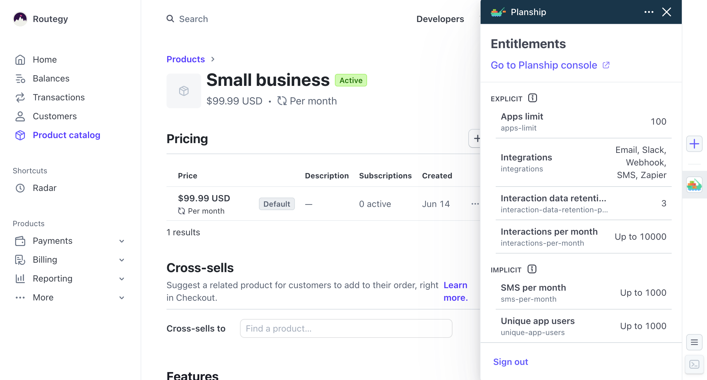
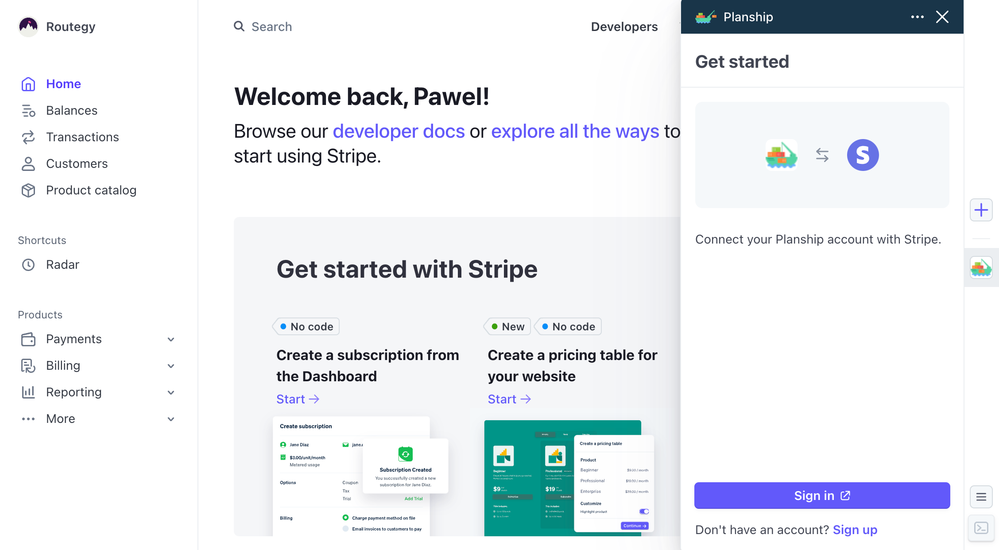
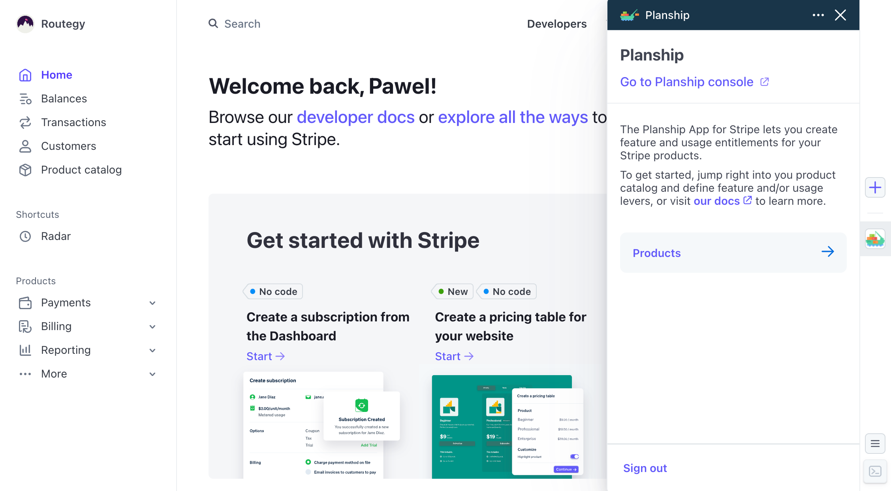
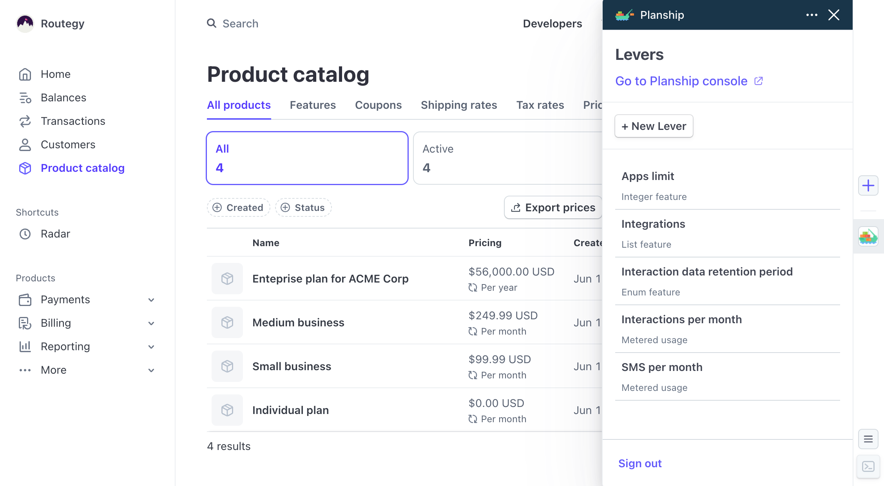
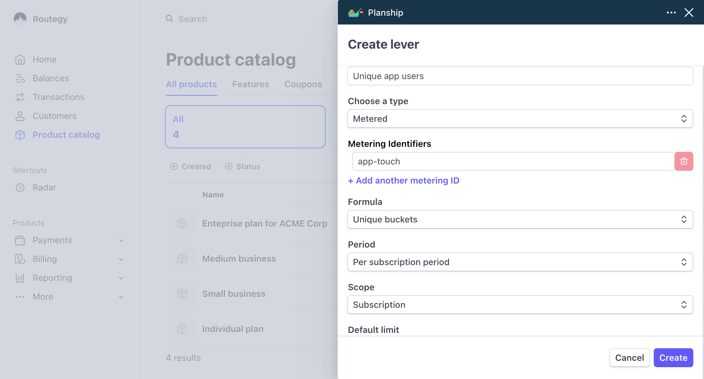
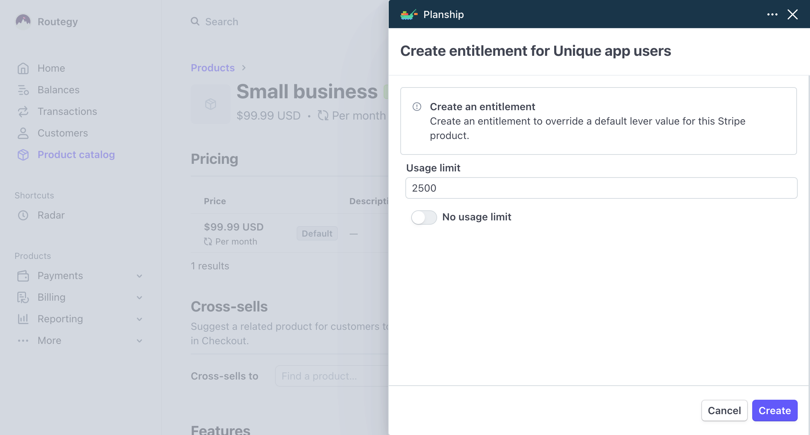

# Using Planship with Stripe

In this guide, we'll walk through how to use Planship with [Stripe](https://stripe.com) using [Planship Stripe app]. Let's get started.

## Why would I use Planship with Stripe?

Stripe is the most popular billing solution used by SaaS companies today. If you are building a SaaS product you likely accept payments from your customers using Stripe, or another pricing solution that uses Stripe under the hood.

While Stripe makes it super easy to setup both subscription and usage based billing, developers often need to implement additional pricing logic to support tiered subscription plans, report usage, enforce feature and usage entitlements and more.

Planship delivers all of this functionality while seemlessly integrating with Stripe - no changes to the existing Stripe configuration or integration code required.

## How does it work?

Planship app for Stripe lets you define [***feature***](../concepts/feature-levers.md) and [***metered***](../concepts/metered-levers.md) levers, and configure [***entitlements***](../concepts/plans.md#entitlements) for your Stripe products, all directly from the Stripe UI.

<figure markdown="span">
  { width="600" }
  <figcaption>Planship Entitlements for Stripe</figcaption>
</figure>

With entitlements defined, you can use any Planship SDK of your choice to retrieve and enforce entitlements, report and retrieve usage information, manage team subscriptions and more.

<figure markdown="span">
  { width="600" }
  <figcaption>Planship entitlements with autocomplete </figcaption>
</figure>

What's more, Planship automatically mirrors all of your Stripe products, customers and subscriptions. so once Planship and Stripe accounts are connected, everything is on auto-pilot.

## Getting started

To get started, install Planship app from the Stripe marketplace into your Stripe account.
Next, open Planship app from the app drawer and sign into your Planship account, or sing-up for a new account.

<figure markdown="span">
  { width="600" }
  <figcaption>Planship sign-in view</figcaption>
</figure>

Once you are singed in and the accounts are connected, Planship will automatically create a new [organization](../concepts/products.md#organizations) for your Stripe account, and mirror all of your products, customers and subscriptions (as Planship [plans](../concepts/plans.md), [customers](../concepts/customers.md) and subscriptions respectively).

!!!note
    Planship will continue to mirror your Stripe resources using Stripe webhooks as long as Stripe and Planship are connected, and even if you are not signed into the Planship app.

You are now ready to define Planship levers and entitlements.

<figure markdown="span">
  { width="600" }
  <figcaption>Planship home view</figcaption>
</figure>

## Step 1 - Define levers

First, you need to define [***feature***](../concepts/feature-levers.md) and [***usage***](../concepts/metered-levers.md) levers that represent dimensions that you price on. To manage levers, navigate to your Product catalog by clicking the **Products** link in the Planship app default view, or Stripe's **Product catalog** link.

Once you are in Stripe's products view, the Planship will app will display the  **Levers** view where can see a view and manage of your existing levers.

<figure markdown="span">
  { width="600" }
  <figcaption>Planship levers view</figcaption>
</figure>

To create a new lever, click the **New lever** button and configure the lever by choosing its name, type, and additional settings like default value. Once done, click the **Create** button to save changes.

<figure markdown="span">
  { width="600" }
  <figcaption>Creating a new lever</figcaption>
</figure>

## Step 2 - Configure entitlements

With levers defined, you can now configure feature and usage [***entitlements***](../concepts/plans.md#entitlements) for individual products. Navigate to the product view in the Stripe dasboard (E.g. click its name in the Product Catalog), and the Planship app will display the **Entitlements** view for that product.

<figure markdown="span">
  { width="600" }
  <figcaption>Product entitlements</figcaption>
</figure>

By default, every product has only _implicit entitlements_ that are set to default configured for their corresponding levers. To override a default value, click an _implicit entitlement_, configure its value, and click the **Create** button to create the new _explicit entitlement_.

<figure markdown="span">
  { width="600" }
  <figcaption>Creating an explicit entitlement</figcaption>
</figure>

Existing _explicit entitlements_ can be modified or deleted in the same way.

!!!note
    Removing an _explicit entitlement_ turns it into an _implicit_ one that carries the default value of its corresponding lever.

## Step 3 - Add Planship integration to your product code

With levers and entitlements defined, you can integrate Planship into your product code by following our [integration guide](../integration/index.md#step-2-integrate-planship-into-your-product-code). Please note, that when using Planship with Stripe you won't need to register customers and create/delete their subscriptions via Planship API. Customers and subscriptions are managed by Stripe, and automatically mirrored by Planship.
