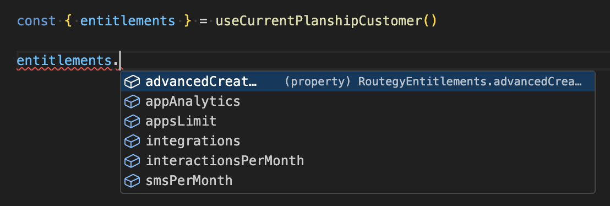

# Using Planship with Stripe

In this guide, we'll walk through how to use Planship with [Stripe](https://stripe.com) using the [Planship app for Stripe](https://marketplace.stripe.com/apps/planship). Let's get started.

## Why should I use Planship with Stripe?

Stripe is the most popular billing solution for SaaS companies today. If you're building a SaaS product you likely accept payments with Stripe or use a pricing solution that relies on Stripe under the hood.

While Stripe makes it easy to add subscription and usage-based billing schemes to SaaS products, developers still have to build lots of additional logic to handle related functionality that falls outside of Stripe's offering - things like plan-defined feature entitlements and usage-based limits, team subscriptions, usage aggregation, customer provisioning, subscription data models, upsell logic, etc.

Planship delivers this additional functionality while seemlessly integrating with Stripe - no changes to your existing Stripe configuration or integration code required.

## How does it work?

Once your Planship and Stripe accounts are connected, Planship will automatically mirror all of your Stripe products, customers, and subscriptions.

You can then define [***feature***](../concepts/feature-levers.md) and [***metered***](../concepts/metered-levers.md) levers and configure [***entitlements***](../concepts/plans.md#entitlements) for your Stripe products, all directly from the Stripe UI.

<figure markdown="span">
  { width="600" }
  <figcaption>Planship Entitlements for Stripe</figcaption>
</figure>

With entitlements defined, you can use the Planship SDK of your choice within your product to retrieve and enforce entitlements, report and retrieve usage information, manage team subscriptions, and more.

<figure markdown="span">
  { width="600" }
  <figcaption>Planship entitlements with autocomplete </figcaption>
</figure>

## Getting started

To get started, install the Planship app from the Stripe marketplace into your Stripe account. Next, open the Planship app from the app drawer and sign into your Planship account or create a new account.

<figure markdown="span">
  { width="600" }
  <figcaption>Planship sign-in view</figcaption>
</figure>

Once you've signed in and your Planship and Stripe accounts are connected, Planship will automatically create a new Planship [organization](../concepts/products.md#organizations) for your Stripe account, mirroring all of your products, customers, and subscriptions as Planship [plans](../concepts/plans.md), [customers](../concepts/customers.md), and [subscriptions](../concepts/plans.md#subscribing-and-unsubscribing-customers) respectively.

!!! note
    Planship will continue to mirror your Stripe resources using Stripe webhooks as long as Stripe and Planship are connected, even when you are not signed into the Planship app.

You are now ready to define Planship levers and entitlements.

<figure markdown="span">
  { width="600" }
  <figcaption>Planship home view</figcaption>
</figure>

## Step 1 - Define levers

First, you need to define [***feature***](../concepts/feature-levers.md) and [***usage***](../concepts/metered-levers.md) levers that represent your pricing dimensions. To do this, navigate to your Product catalog by clicking the **Products** link in the Planship app's default view or Stripe's **Product catalog** link.

Once you're on Stripe's products view, the Planship app will display the **Levers** view where you can view and manage  your existing levers.

<figure markdown="span">
  { width="600" }
  <figcaption>Planship levers view</figcaption>
</figure>

To create a new lever, click the **New lever** button and configure the lever by specifying its name, type, and additional settings like its default value. Once done, click the **Create** button to save your changes.

<figure markdown="span">
  { width="600" }
  <figcaption>Creating a new lever</figcaption>
</figure>

## Step 2 - Configure entitlements

With levers defined, you can now configure feature and usage [***entitlements***](../concepts/plans.md#entitlements) for individual products. Navigate to the product view in the Stripe dasboard (E.g. click its name in the Product Catalog), and the Planship app will display the **Entitlements** view for that product.

<figure markdown="span">
  { width="600" }
  <figcaption>Product entitlements</figcaption>
</figure>

By default, every product has _implicit entitlements_ that are set to the default values configured in their corresponding levers. To override a default, implied value, click an _implicit entitlement_, configure its value, and click the **Create** button to create a new _explicit entitlement_.

<figure markdown="span">
  { width="600" }
  <figcaption>Creating an explicit entitlement</figcaption>
</figure>

Existing _explicit entitlements_ can be modified or deleted in the same way.

!!! note
    Removing an _explicit entitlement_ turns it into an _implicit_ one that carries the default value of its corresponding lever.

## Step 3 - Add Planship integration to your product code

With levers and entitlements defined, you can integrate Planship into your product code by following our [integration guide](../integration/index.md#step-2-integrate-planship-into-your-product-code). Please note that when using Planship with Stripe you don't need to register customers or create/delete their subscriptions via the Planship API. Customers and subscriptions are managed by Stripe and automatically mirrored by Planship.

- [Choosing the right Planship SDK for your project](../integration/index.md#choosing-the-right-sdk-for-your-project)
- [Retrieving customer entitlements](../integration/entitlements.md)
- [Reporting usage for metered levers](../integration/usage.md)
